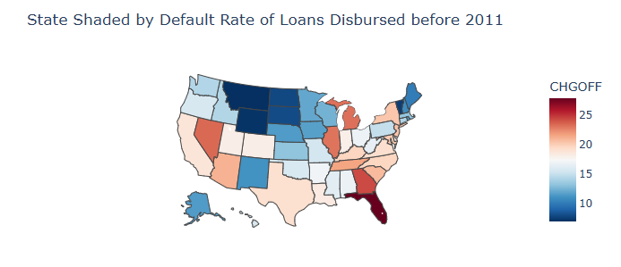
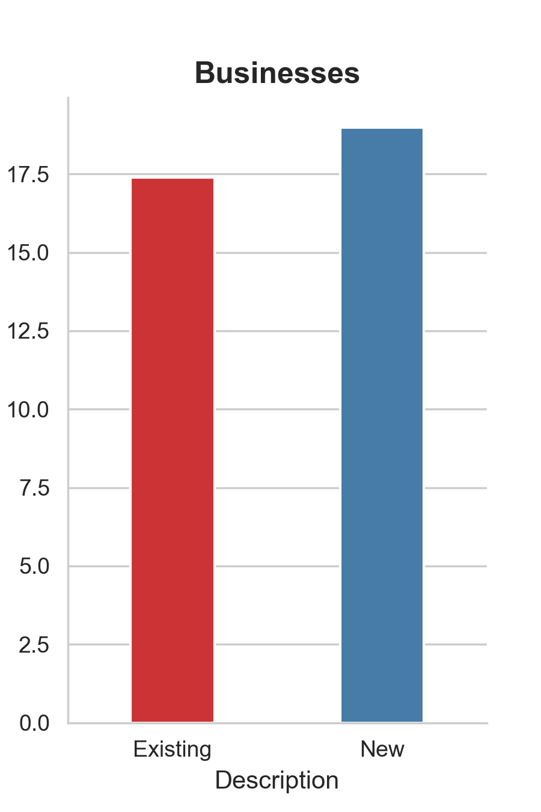
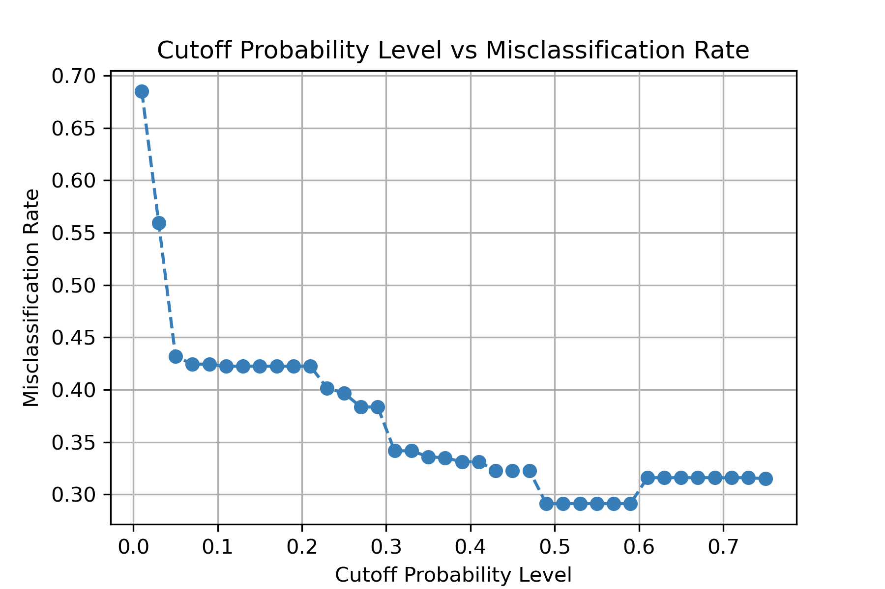

# SBA Loan Default Risk Prediction

This project follows the methodology of the article *[“Should This Loan be Approved or Denied?”](https://doi.org/10.1080/10691898.2018.1434342)*, identifying indicators of potential risk in SBA loan data, building and validating a logistic regression model, and applying the model to make lending decisions.

## Data

The datasets are **not included** in the repository.  

You can download them from **[here](https://drive.google.com/drive/folders/1BzDlg9ayYNchEKgYmHkag7I4XJEdOmjf?usp=sharing).**
Take the entire `Data` folder and put it inside your project folder.

# Identifying Predictors of Potential Risk
### Location:

- States like Florida, D.C., and Georgia have the highest loan default rates (>23%), indicating higher credit risk.
- Mountain and Northern Plains states like Montana, Wyoming, and Vermont have the lowest default rates (<8%), showing relatively safer lending environments.

### Industry:
- Real Estate, Finance, and Transportation show the highest default rates (~28–29%), indicating high-risk sectors.
- Mining, Health Care, and Management have the lowest default rates (<11%), suggesting more stable lending.

### Gross Disbursement:
**CHGOFF and PIF Quartiles**
| Quartiles     | Default     | Repaid     |
|---------------|-------------|------------|
| 100% maximum  | $4,362,157  | $11,446,325|
| 75% quartile  | $140,613    | $255,000   |
| 50% median    | $61,864     | $100,000   |
| 25% quartile  | $27,746     | $49,449    |
| Minimum       | $4,000      | $4,000     |

- Smaller loans are more likely to default.
- Large loans are often safer: 75% quartile for repaid 255K > defaulted $140K.
- `DisbursementGross` is a strong predictor: Clear difference between distributions for defaulted vs repaid loans.

### New versus Established Businesses:

- New businesses default slightly more than existing businesses.
- `NewExist` is not a strong predictor.

### Loans Backed by Real Estate:

| RealEstate                         | Default % | Repaid % |
|------------------------------------|---------|--------|
| Backed by Real Estate (Term ≥ 240 months) | 1.64    | 98.36  |
| Not Backed by Real Estate           | 21.19   | 78.81  |

- Real-estate loans are far safer, with 12-13x lower default risk.
- `RealEstate` is a strong predictor.

### Economic Recession:

- Loans active during the Great Recession have a higher default rate (32.3%) than loans that were not active during the Recession (16.9%).
- `Recession` shows some economic impact and may support other predictors in the model.

### SBA's Guaranteed Portion of Approved Loan:

- Defaulted loans tend to have a slightly lower median SBA portion than fully paid loans.
- Both distributions are similar, suggesting SBA coverage has limited direct effect on default rates.
- `Portion` is not a very strong predictor, though it may support other predictors in the model.

# Building and Validating the Model
### Initial Model

**Type 3 Test Results**
| Variable           | DF | Chi-Square | Pr > ChiSq |
|-------------------|----|------------|------------|
| New               | 1  | 0.14       | 0.7130     |
| RealEstate        | 1  | 39.96      | 0.0000     |
| DisbursementGross | 1  | 0.97       | 0.3258     |
| Portion           | 1  | 27.41      | 0.0000     |
| Recession         | 1  | 4.27       | 0.0389     |

- `RealEstate` and `Portion` are highly significant, meaning they strongly affect default probability.
- `Recession` is mildly significant.
- `New` and `DisbursementGross` are not significant, so they may not contribute meaningfully once other variables are included.

### Final Model
**Logit Regression Results**
| Variable    | Coef   | Std_Err | z      | P_value | 0.025  | 0.975  |
|------------|-------|---------|--------|---------|--------|--------|
| const      | 1.393 | 0.322   | 4.332  | 0.000   | 0.763  | 2.023  |
| RealEstate | -2.128| 0.345   | -6.169 | 0.000   | -2.804 | -1.452 |
| Portion    | -2.988| 0.539   | -5.540 | 0.000   | -4.044 | -1.931 |
| Recession  | 0.504 | 0.241   | 2.090  | 0.037   | 0.031  | 0.977  |

**Changes in results:**
- **Model fit:** Pseudo R² remained nearly unchanged (0.174 → 0.173), indicating no meaningful loss in explanatory power.
- **Log-Likelihood:** Slight change from -540.85 to -541.38 despite removing 2 predictors, confirming they contributed little.
- **Significance:** The remaining predictors retained their effect sizes and statistical significance.

Dropping non-significant variables simplified the model without reducing predictive strength, improving interpretability.

### Decision Rule

- There is an optimal cutoff value around 0.5 cutoff where the misclassification rate is minimized.

### Validation and Misclassification
**Confusion Matrix**

| Classification | Defaulted | Fully Paid | Total |
|----------------|-----------|------------|-------|
| High Risk      | 31        | 14         | 45    |
| Low Risk       | 324       | 682        | 1006  |
| Total          | 355       | 696        | 1051  |

**Misclassification rate at cutoff 0.5: 32.16%**
- High Risk → 31 correctly predicted defaults, 14 incorrect fully paid predictions.
- Low Risk → 682 correctly predicted fully paid, 324 missed defaults.

This confirms that the 0.5 cutoff is close to optimal based on the misclassification rate curve.

**ROC Curve:**

**Summary:**

The model has a fair ability to classify positives and negatives, with an AUC of 0.735 indicating moderate predictive performance.

# Using the Model to Make Decisions

**Loan Applications**

| Loan | Date                   | Loan Amount Requested | SBA Portion Guaranteed | Secured by Real Estate? | Estimated Probability of Default | Approve? |
|------|------------------------|---------------------|-----------------------|------------------------|---------------------------------|----------|
| 1    | Current (not recession)| $1,000,000          | $750,000              | Yes                    | 0.05                            | Yes      |
| 2    | Current (not recession)| $100,000            | $40,000               | No                     | 0.55                            | No       |

### Summary:
Based on the predictions from the logistic regression model, the classification was accurate and interpretable.
The model successfully identified low and high-risk loans using meaningful features.

